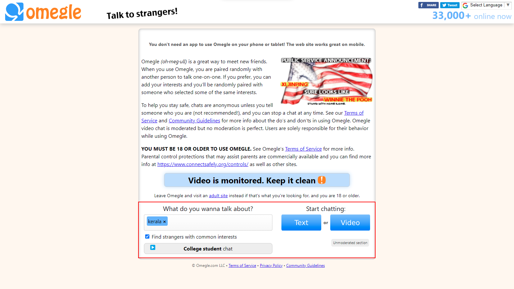

# Omegle Chatbot

An omegle chatbot🤖 especially for boys to find F (those who use omgele will get it fast) using selenium on chrome web browser

## Read documentation about selenium

<a href = "https://selenium-python.readthedocs.io/">Selenium</a>

## Run locally

You will need to install Python on  you system. Head over to https://www.python.org/downloads/ to download python.
(Dont Forget to Tick Add to Path while installing Python)

Once you have downloaded Python on your system, 
run the following command inside your terminal (If your system is git enabled, otherwise download the zip file and extract it)

```bash
  git clone https://github.com/milan-sony/Omegle_Chatbot.git
```

Then go to the project folder

```bash
  cd Omegle_Chatbot
```

(This is optional, but strongly recommended) Make a virtual environment

```bash
  python -m venv venv
```

Activate the virtual environment

```bash
  venv/Scripts/activate
```

If error occurs when activating virtual environment, run the following command

```bash
  Set-ExecutionPolicy Unrestricted
```

Install the dependencies needed for this project

```bash
  pip install -r requirements.txt
```

Now run the script

```bash
  python bot.py
```

Now sit back and enjoy, let the bot do the work

## Working

This bot works in such a way that

1st it will take the topics from topics.py and add this topics to talk about section on omegle (Topics can be added by the user in topics.py file)




If reCAPTCHA occurs get rid of it by yourself

Then the bot will ask the stranger whether he/she is M or F (Male or Female)


If responce of the stranger is M (Male) it will skip the stranger 


If the stranger skips without answering anything the bot will wait for 10 sec and skips


If the responce of the stranger is F (Female) it will make a beep sound and the bot will sleep for 5 min and it will stop execution (time can be changed in the program)

If stranger (F) skips you, you have to run the code again

## Points to be noted

You can change the messages according to your need

Actually it's not 100% accurate there may be some faults while running the program (If any error occurs exit the code and run again)

## Future updates

- May add [Natural Language Processing](https://www.ibm.com/in-en/topics/natural-language-processing#:~:text=Natural%20language%20processing%20(NLP)%20refers,same%20way%20human%20beings%20can.) (NLP)
